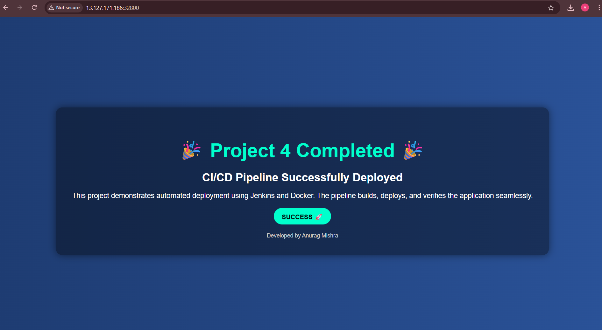

🚀 CI/CD Pipeline with Jenkins & Docker (Project 4)

📌 Project Overview

This project demonstrates a complete CI/CD pipeline using Jenkins and Docker to automate the build and deployment of a web application.

🔗 GitHub Repository

👉 Project Link:- https://github.com/Anurag842321/skillfied-project-4

🛠️ Tech Stack
Jenkins (CI/CD Automation)
Docker (Containerization)
Nginx (Web Server)
Rocky Linux (Base Image)

📂 Project Structure
.
├── Dockerfile
├── Jenkinsfile
├── index.html
├── images/
│   └── output.png
└── README.md

🖼️ Application Screenshot

⚙️ Dockerfile Explanation

Uses Rocky Linux 9 as base image
Installs Nginx
Copies custom HTML page
Exposes port 80
Runs Nginx in foreground

🔁 Jenkins Pipeline Stages

1️⃣ Build Image
docker build -t myapp:${BUILD_ID} --no-cache .
2️⃣ Deploy Container
docker stop app1 || true
docker rm app1 || true
docker run --name app1 -dit -p 32800:80 myapp:${BUILD_ID}
3️⃣ Verify
docker ps -a

🌐 Application Output
http://<SERVER-IP>:32800

📊 Key Features

✅ Automated Docker image build
✅ Container redeployment
✅ CI/CD pipeline with Jenkins
✅ Screenshot included for proof
✅ Beginner-friendly DevOps project

👨‍💻 Author

Anurag Mishra
GitHub: https://github.com/Anurag842321
